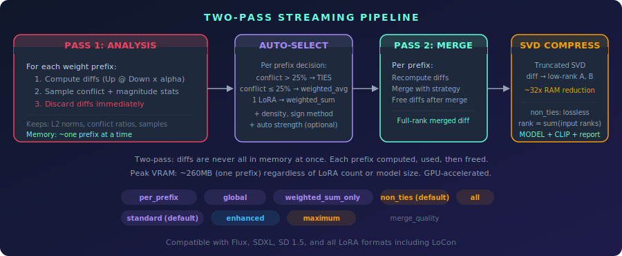
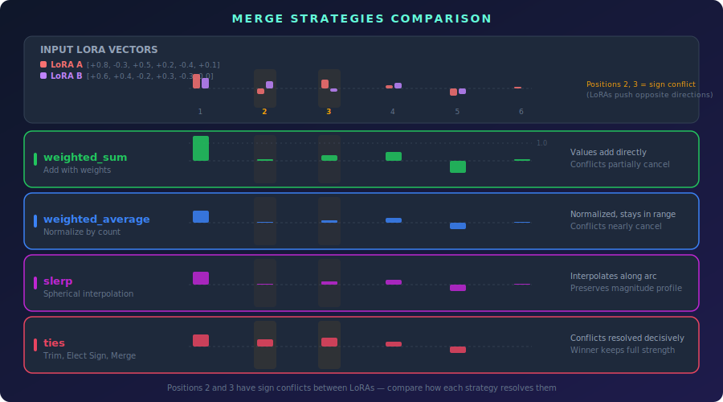
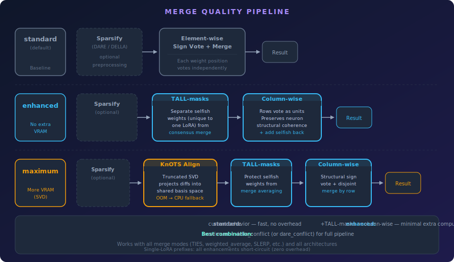
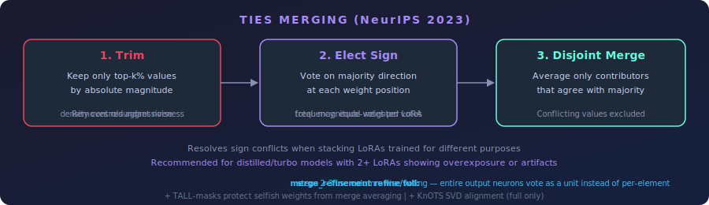

# Adaptive Per-Group LoRA Composition with Interference-Aware Energy Normalization

**Contributors:** Ethanfel, Claude (Anthropic), Scruffy, Ramonguthrie, srv1n

## Abstract

Low-Rank Adaptation (LoRA) enables efficient fine-tuning of large diffusion models, but composing multiple LoRAs at inference time remains problematic. Naive additive stacking causes oversaturation and visual artifacts when two or more LoRAs modify overlapping weight regions, while existing merge strategies (TIES, DARE, DELLA) apply a single global policy that either over-corrects non-conflicting regions or under-corrects genuine interference. We present a system that analyzes conflict patterns *per weight group* and independently selects the merge strategy best suited to each group's local statistics. Our approach introduces (i) an *excess conflict* metric that separates real sign interference from the baseline noise inherent in orthogonal vectors, (ii) an interference-aware energy normalization that scales combined LoRA strengths so that the merged output matches the energy of the strongest individual contributor, and (iii) a heuristic proxy scoring function that enables automated parameter search without image generation. The system integrates TIES, DARE/DELLA, KnOTS SVD alignment, TALL-masks, and Gram-Schmidt orthogonalization into a unified refinement pipeline, selecting which combination to apply on a per-group basis. A two-pass streaming architecture keeps peak memory proportional to the largest single weight group rather than the full LoRA stack. To our knowledge, this is the first system to adaptively select merge strategies per weight group based on local conflict analysis.

## 1. Introduction

### 1.1 Background

Low-Rank Adaptation (LoRA) [Hu et al., 2022] has become the dominant method for fine-tuning large generative models. By decomposing weight updates into low-rank matrices ΔW = BA where B ∈ ℝ^(d×r) and A ∈ ℝ^(r×k) with rank r ≪ min(d, k), LoRA reduces trainable parameters by orders of magnitude while preserving model quality. The resulting adapters are small, portable, and composable—users routinely share LoRAs trained for specific styles, characters, or concepts.

### 1.2 The Composition Problem

In practice, users want to combine multiple LoRAs simultaneously: a style LoRA with a character LoRA with a detail-enhancement LoRA. The simplest approach—additive stacking—applies each LoRA's update independently:

> **W' = W₀ + Σᵢ sᵢ · Bᵢ Aᵢ**

This works reasonably well for a single LoRA but breaks down at N ≥ 2. When multiple LoRAs modify the same weights, their updates can reinforce (causing oversaturation), cancel (losing trained effects), or interfere (producing artifacts). The severity depends on the *alignment* between LoRAs: highly aligned LoRAs compound their effects, while orthogonal LoRAs produce unpredictable interactions in specific layers.

### 1.3 Existing Approaches

Several methods address the model merging problem:

- **TIES-Merging** [Yadav et al., 2023] trims low-magnitude parameters, elects a majority sign per position, and merges only values agreeing with the elected sign.
- **DARE** [Yu et al., 2024] randomly drops parameters with probability 1 − p and rescales survivors by 1/p, reducing interference through sparsity.
- **DELLA** [Deep et al., 2024] extends DARE with magnitude-aware dropout, preferentially dropping low-magnitude parameters.
- **KnOTS** [Ramé et al., 2024] aligns models via shared SVD bases before merging.
- **TALL-masks** [Wang et al., 2024] protects task-specific "selfish" weights from being diluted during averaging.

All of these methods apply a **single global strategy** across the entire model. This is a significant limitation: conflict patterns vary dramatically across layers and weight groups. A face LoRA and a style LoRA may conflict strongly in mid-layer attention projections while being nearly independent in early convolutional features or late normalization parameters.

### 1.4 Our Insight

We observe that the optimal merge strategy depends on *local* statistics—cosine similarity, sign conflict rate, magnitude ratio, and subspace overlap—which vary substantially across weight groups within the same model. A global strategy necessarily compromises: TIES wastes trimming capacity on non-conflicting regions, while weighted averaging fails to resolve genuine conflicts in specific attention layers.

### 1.5 Contributions

We make the following contributions:

1. **Per-group adaptive merge strategy selection.** Each resolved target group independently selects its merge strategy (weighted average, SLERP, consensus, or TIES) based on local conflict metrics, with architecture-aware thresholds.

2. **Excess conflict metric.** We separate real sign interference from the statistical baseline inherent in randomly-oriented vectors, preventing false-positive conflict detection for orthogonal LoRAs.

3. **Interference-aware energy normalization.** We compute the exact combined energy of N weighted LoRAs including cross-term interactions and scale strengths so that the merged output's Frobenius norm matches the strongest individual contributor.

4. **Heuristic proxy scoring.** We define a composite scoring function over merge configurations that enables automated parameter search without requiring image generation, enabling fast exploration of the configuration space.

5. **Unified refinement pipeline.** We integrate TIES, DARE/DELLA, KnOTS, TALL-masks, and Gram-Schmidt orthogonalization into a single ordered pipeline, applying each component adaptively based on local metrics.

6. **Two-pass streaming architecture.** We separate analysis (Pass 1) from merging (Pass 2), streaming weight groups one at a time so that peak memory scales with the largest single group rather than the full LoRA stack.

## 2. Related Work

**LoRA** [Hu et al., 2022] introduced low-rank adaptation for large language models, decomposing weight updates as ΔW = BA with a scaling factor α/r. Originally proposed for language models, LoRA has been widely adopted for diffusion model fine-tuning across Stable Diffusion, FLUX, and video architectures.

**TIES-Merging** [Yadav et al., 2023] addresses task vector interference through three steps: trimming low-magnitude values, electing a majority sign per parameter position, and merging only same-sign values. TIES was designed for full model merging but applies directly to LoRA composition when LoRA updates are materialized as full-rank diffs.

**DARE** [Yu et al., 2024] applies random Bernoulli dropout to task vectors before merging, with rescaling to preserve expected magnitude. The key insight is that sparsification reduces the probability of conflicting updates at any given position. DAREx extends this with a dampening parameter that interpolates the rescaling factor between aggressive (1/p) and conservative (1.0).

**DELLA** [Deep et al., 2024] improves on DARE by making dropout magnitude-aware: low-magnitude parameters receive higher drop probability, preserving the most important updates. The drop probability for each parameter is a function of its magnitude rank within the row.

**KnOTS** [Ramé et al., 2024] aligns model updates into a shared SVD basis before merging, improving comparability between task vectors trained from different initializations or with different objectives.

**TALL-masks** [Wang et al., 2024] identifies "selfish" weights—positions where only one task's update is important—and protects them from being diluted during averaging. Selfish weights are extracted before the merge and added back afterward at full strength.

**ZipLoRA** [Shah et al., 2025] enforces column-wise structural sparsity to reduce interference between subject and style LoRAs, optimizing merge coefficients per column.

**DO-Merging** [Li et al., 2025] decouples task vectors into magnitude and direction components, then orthogonalizes the directions via Modified Gram-Schmidt before recombining. This reduces directional interference while preserving learned magnitudes.

**Model Soups** [Wortsman et al., 2022] introduced greedy interpolation for combining fine-tuned models, adding each candidate to the soup only if it improves validation performance.

**Positioning.** All methods listed above apply one strategy globally across the entire model. Our system adapts the merge strategy independently per weight group based on local conflict analysis, and combines multiple techniques (TIES, DARE/DELLA, KnOTS, TALL-masks, orthogonalization) into a unified pipeline selected adaptively.

## 3. Method

### 3.1 Problem Formulation

Given N LoRA adapters, each consisting of low-rank factor pairs (Bᵢ, Aᵢ) for a subset of target weights, with user-specified strengths sᵢ, we seek to produce merged weight patches that combine the effects of all N LoRAs without destructive interference.

Each LoRA modifies a subset of the base model's weight matrices. For a given target weight matrix W₀, the i-th LoRA contributes an update ΔWᵢ = sᵢ · Bᵢ Aᵢ · (αᵢ / rᵢ), where αᵢ is the LoRA scaling factor and rᵢ is the rank. We refer to the materialized update ΔWᵢ as the *diff* for LoRA i.

The key insight motivating our approach is that LoRAs trained on different concepts (e.g., an anime style vs. a photorealistic face) exhibit spatially varying conflict patterns: some weight groups see highly aligned updates (reinforcement), others see orthogonal updates (independence), and others see opposing updates (destructive interference). A single global merge strategy cannot optimally handle all three regimes.

### 3.2 Two-Pass Streaming Architecture

Our system processes LoRA compositions in two passes over the weight groups, keeping memory usage proportional to the largest single group rather than the full stack.

  
   
  <em>Figure 1: Two-pass streaming architecture. Pass 1 computes lightweight statistics per group and immediately discards weight diffs. Pass 2 recomputes diffs one group at a time, applies the selected merge strategy, and frees each group before proceeding to the next.</em>

**Pass 1 (Analysis).** For each target group, we compute the full-rank diffs ΔWᵢ, extract lightweight scalar statistics (conflict ratios, cosine similarities, magnitude norms, subspace overlap estimates), accumulate them into per-prefix and pairwise accumulators, and immediately discard the diffs. Only scalar statistics survive Pass 1, keeping memory independent of the number of weight groups.

**Pass 2 (Merge).** For each target group, we recompute the diffs, look up that group's statistics from Pass 1, select a merge strategy based on local metrics, apply the selected strategy (with optional refinement), and free the group's memory before proceeding. The merged result is stored as a model patch.

This design trades compute (recomputing diffs in Pass 2) for memory (never holding more than one group's diffs at a time). For typical LoRA ranks (r ≤ 128), diff computation is fast relative to the merge itself.

*Implementation:* `optimize_merge()` (line 5008), `_run_group_analysis()` (line 3946), `_merge_one_group()` (line 5431).

### 3.3 Conflict Analysis

We compute pairwise conflict metrics between all LoRA pairs for each target group. The analysis operates on the materialized diffs ΔWᵢ and produces several complementary metrics.

**Pairwise sign conflict ratio.** For two diffs **a** and **b**, we identify positions where both have non-zero values (the *overlap* set) and compute the fraction of overlapping positions where the signs disagree:

> **conflict_ratio = |{j : sign(aⱼ) ≠ sign(bⱼ)}| / |{j : aⱼ ≠ 0 ∧ bⱼ ≠ 0}|**

**Magnitude-weighted conflict.** Raw conflict ratio treats all positions equally. We weight each position by min(|aⱼ|, |bⱼ|)—the *minimum* absolute value—to focus on positions where both LoRAs have significant magnitude. A noise floor at ε = 5% of max(RMS(**a**), RMS(**b**)) restricts analysis to positions where *both* values exceed the threshold, ensuring that conflicts are only measured between positions where both LoRAs are actively contributing:

> **wⱼ = min(|aⱼ|, |bⱼ|),   for j where |aⱼ| > ε and |bⱼ| > ε**
>
> **weighted_ratio = Σ(wⱼ where signs disagree) / Σ(wⱼ)**

**Cosine similarity.** Directional alignment between diffs:

> **cos θ = (a · b) / (‖a‖ · ‖b‖)**

**Expected conflict baseline.** For two vectors with angle θ, the probability that a randomly sampled coordinate has opposing signs is θ/π. We use this as the statistical baseline for sign conflict:

> **expected_conflict = arccos(cos θ) / π**

This captures a critical property: orthogonal vectors (cos θ = 0) have an expected sign conflict rate of 50%. Any observed conflict at or below this level is *noise*, not real interference.

**Excess conflict** (novel). The conflict beyond what random vectors at the observed angle would exhibit:

> **excess_conflict = max(weighted_ratio − expected_conflict, 0)**

This metric cleanly separates real interference from statistical noise. Orthogonal LoRAs with ~50% raw sign conflict correctly show near-zero excess conflict, while LoRAs with genuine interference show positive excess conflict.

**Subspace overlap.** We estimate the shared representational subspace between two LoRA diffs using their low-rank bases. When the original low-rank factors are available, we extract orthonormal bases Q_A and Q_B for each LoRA's left (and right) singular subspaces, compute the cross-Gram matrix C = Q_Aᵀ Q_B, and measure overlap as ‖C‖²_F / min(r_A, r_B), averaged over left and right bases. This yields 1.0 when the subspaces are identical and 0.0 when they are fully orthogonal.

**Effective conflict.** We combine excess conflict with subspace overlap to produce the final conflict signal used for strategy selection. When excess conflict data is available, it replaces the raw conflict ratio. Subspace overlap then modulates the signal:

> - If **overlap > 0**: effective_conflict = excess_conflict · (0.5 + 0.5 · overlap)
> - If **overlap = 0**: effective_conflict = excess_conflict  *(no discount — absence of measurable overlap does not imply absence of interference)*
> - If **excess conflict unavailable**: effective_conflict = raw_conflict_ratio  *(fallback)*

When subspace overlap is positive, the modulation factor (0.5 + 0.5 · overlap) discounts conflict for LoRAs operating in largely disjoint subspaces. When overlap is exactly zero (no shared subspace detected), the full excess conflict is used without discount. When excess conflict data is unavailable (e.g., subsampling skipped the pair), the system falls back to the raw conflict ratio.

*Implementation:* `_sample_pair_metrics()` (line 1702).

### 3.4 Per-Group Adaptive Strategy Selection

After Pass 1 accumulates per-group statistics, each target group independently selects its merge strategy via a decision tree with architecture-aware thresholds. The system supports four primary merge strategies:

  
   
  <em>Figure 2: Merge strategy comparison. Weighted average blends uniformly; SLERP preserves magnitude during interpolation; consensus uses importance-weighted voting; TIES trims, elects signs, and merges disjoint components.</em>

The strategy selection decision tree operates as follows:

| Priority | Condition | Selected Strategy | Rationale |
|----------|-----------|-------------------|-----------|
| 1 | Single LoRA in group | `weighted_sum` | No merge needed; apply at full strength |
| 2 | cos θ > 0.5, conflict < 0.15, overlap ≥ 0.35 | `consensus` | Highly aligned LoRAs; Fisher-proxy importance weighting |
| 3 | \|cos θ\| < 0.25, conflict < 0.60, overlap < 0.35 | `weighted_average` | Orthogonal LoRAs; sign conflict is base-rate noise |
| 4 | Effective conflict > 0.25 | `ties` | Genuine interference; trim/elect/disjoint merge |
| 5 | Fallback | `weighted_average` | Low conflict; simple blending suffices |

**Table 1:** Per-group strategy selection decision tree. Thresholds shown are defaults from the `sd_unet`/`dit` architecture presets (line 69).

**SLERP upgrade.** When `weighted_average` is selected for a group with N ≥ 2 non-opposing LoRAs, it is upgraded to SLERP (spherical linear interpolation). SLERP preserves the magnitude of interpolated vectors, avoiding the 1/N magnitude reduction inherent in arithmetic averaging. The upgrade requires all of: (i) the LoRAs are not opposing (cos θ ≥ 0), (ii) `strategy_set == "full"`, and (iii) the architecture preset does not disable the SLERP upgrade for full-rank patches (`not (is_full_rank and disable_slerp_upgrade)`).

**Sign method selection.** When TIES is selected, the sign election method depends on the magnitude ratio between the strongest and weakest LoRAs in the group:

> - If **magnitude_ratio > 2.0**: sign_method = `total` (magnitude-weighted voting)
> - Otherwise: sign_method = `frequency` (equal voting)

The `total` method weights votes by magnitude (the stronger LoRA's sign dominates), while `frequency` gives each LoRA an equal vote. When one LoRA is substantially stronger, total-weighted voting prevents the weaker LoRA from outvoting the dominant one.

**Decision smoothing.** Per-group metrics can be noisy, causing strategy flips between adjacent layers in the same transformer block. We apply block-level smoothing: metrics for groups within the same logical block (e.g., `double_blocks.12`) are blended toward their weighted average:

> **m̂ᵢ = (1 − λ) · mᵢ + λ · m̄_block**

where λ is the smoothing strength (default 0.25) and m̄_block is the norm-weighted block average. This reduces noisy oscillations while preserving genuine cross-block differences.

*Implementation:* `_auto_select_params()` (line 4516), `_apply_block_smoothing()` (line 4456).

### 3.5 Interference-Aware Energy Normalization

When N LoRAs are combined, the total energy (Frobenius norm) of the merged update depends on how the individual updates interact. Aligned LoRAs produce N× the energy of a single LoRA; orthogonal LoRAs produce √N×; opposing LoRAs partially cancel. Without normalization, even mildly aligned LoRAs cause oversaturation.

We compute the exact combined energy during Pass 1 using per-LoRA norms and pairwise dot products:

> **E² = Σᵢ sᵢ² · nᵢ + 2 · Σᵢ<ⱼ sᵢ · sⱼ · dᵢⱼ**

where sᵢ is the strength of LoRA i, nᵢ = ‖ΔWᵢ‖²_F is its squared Frobenius norm, and dᵢⱼ = ⟨ΔWᵢ, ΔWⱼ⟩_F is the pairwise Frobenius inner product accumulated across all shared weight groups.

The reference energy is the contribution of the strongest individual LoRA:

> **E_ref = maxᵢ(|sᵢ| · √nᵢ)**

The scale factor normalizes the combined energy to match the reference:

> **scale = min(E_ref / √E², 1.0)**

All strengths are uniformly scaled: sᵢ' = sᵢ · scale.

**Behavior by alignment:**
- *Aligned* (cos θ ≈ 1): cross-terms are large and positive, E² grows superlinearly, scale ≪ 1 (strong reduction).
- *Orthogonal* (cos θ ≈ 0): cross-terms near zero, E² ≈ Σ sᵢ² nᵢ, moderate reduction.
- *Opposing* (cos θ ≈ −1): cross-terms are large and negative, E² shrinks, scale approaches or reaches 1.0 (minimal reduction, capped to prevent amplification).

**Orthogonal floor.** For orthogonal LoRAs, the reduction factor 1/√N can be too aggressive for video generation architectures where each LoRA contributes independent effects. Architecture-specific floors prevent over-attenuation: 0.85 for SD/SDXL and DiT, 0.9 for LLM-based architectures, and 1.0 (no reduction) for video architectures (Wan, LTX).

**Dual-branch computation.** Model and CLIP branches are normalized independently, since their energy profiles can differ substantially (e.g., a style LoRA may have large model updates but small CLIP updates).

*Implementation:* `_compute_branch_auto_scale()` (line 4182).

### 3.6 Merge Refinement Pipeline

Before the final merge operation, an optional refinement pipeline preprocesses the diffs to reduce interference. The pipeline stages execute in a fixed order: **TALL-masks → Orthogonalization → KnOTS alignment**.

  
   
  <em>Figure 3: Merge refinement pipeline. TALL-masks extract selfish weights, orthogonalization reduces directional interference, and KnOTS aligns diffs into a shared SVD basis. The ordering is critical: TALL-masks must precede orthogonalization because orthogonalized diffs have uncorrelated distributions that cause false-positive selfish detection.</em>

#### 3.6.1 TALL-Masks

TALL-masks identify *selfish* positions—weight entries dominated by a single LoRA—and protect them from being diluted during averaging.

For each LoRA i, the contribution at position j is cᵢⱼ = ΔWᵢⱼ · wᵢ where wᵢ is the merge weight. A position is classified as selfish for LoRA i if:

> **|cᵢⱼ| ≥ λ · |dⱼ − cᵢⱼ|**

where dⱼ = Σₖ cₖⱼ is the weighted sum at position j and λ is the importance threshold (default 1.0). Positions where only one LoRA passes this test (agreement count = 1) are extracted before the merge and added back afterward at full strength, bypassing the averaging that would dilute their contribution.

*Implementation:* `_tall_masks()` (line 2148).

#### 3.6.2 Orthogonalization (DO-Merging)

Modified Gram-Schmidt orthogonalization reduces directional interference between LoRA diffs while preserving their magnitudes, following the Decouple-and-Orthogonalize (DO) approach [Li et al., 2025].

Each diff is decomposed into magnitude and direction: ΔWᵢ = ‖ΔWᵢ‖ · ûᵢ. The directions are orthogonalized via Modified Gram-Schmidt:

> **v̂ᵢ = normalize(ûᵢ − Σⱼ<ᵢ ⟨ûᵢ, v̂ⱼ⟩ v̂ⱼ)**

The orthogonalized diffs are then recombined with their original magnitudes: ΔWᵢ' = ‖ΔWᵢ‖ · v̂ᵢ. The operation is performed in-place on the direction vectors.

*Implementation:* `_do_orthogonalize()` (line 2194).

#### 3.6.3 KnOTS SVD Alignment

KnOTS projects all diffs into a shared truncated SVD basis for improved comparability. The diffs are concatenated column-wise into a joint matrix M = [ΔW₁ | ΔW₂ | ··· | ΔW_N], and a truncated SVD is computed: M ≈ UΣVᵀ with rank ≤ 256.

Each diff is then reconstructed in the shared basis:

> **ΔWᵢ' = (UΣ) · Vᵢᵀ**

where Vᵢ is the slice of V corresponding to LoRA i's columns. The reconstruction uses GPU acceleration with CPU fallback for memory-constrained scenarios.

*Implementation:* `_knots_align()` (line 2252).

#### 3.6.4 Ordering Constraint

The pipeline order (TALL-masks → Orthogonalization → KnOTS) is not arbitrary. TALL-masks must execute before orthogonalization because Gram-Schmidt decorrelates the diff distributions, causing positions that were originally dominated by one LoRA to appear evenly distributed across all orthogonalized diffs. Running TALL-masks after orthogonalization produces excessive false-positive selfish detections.

### 3.7 Sparsification (DARE/DELLA)

Sparsification reduces interference by dropping a fraction of parameters before merging. We implement both standard and conflict-aware variants.

  
   
  <em>Figure 4: Sparsification methods. DARE applies uniform Bernoulli dropout; DELLA biases dropout toward low-magnitude parameters. Conflict-aware variants restrict sparsification to positions where LoRAs disagree in sign.</em>

**DARE** (standard). Each parameter is independently kept with probability p (the density) and dropped otherwise. Survivors are rescaled by 1/q where:

> **q = p + δ · (1 − p)**

and δ ∈ [0, 1] is the dampening parameter. Standard DARE uses δ = 0 (rescale by 1/p); higher dampening reduces noise amplification at the cost of lower expected magnitude.

**DELLA.** Drop probabilities are assigned based on magnitude rank within each row. Low-magnitude parameters receive higher drop probability:

> **p_drop(j) = p_min + (ε / n_cols) · rank_desc(j)**

where rank_desc assigns rank 0 to the highest-magnitude parameter. This preferentially preserves high-magnitude updates.

**Conflict-aware variants** (novel application). Standard DARE/DELLA apply uniformly across all positions. Our conflict-aware variants compute a *conflict mask*—positions where two or more LoRAs have opposing signs—and apply sparsification only to masked positions. Non-conflict regions are preserved entirely, concentrating the noise-reduction effect where it is needed.

**Base-rate guard.** When the conflict mask covers more than 40% of positions, conflict-aware sparsification is skipped and standard (uniform) sparsification is used instead. This guard prevents pathological behavior with orthogonal LoRAs, where ~50% of positions show sign disagreement by random chance rather than genuine conflict.

**TIES interaction.** When DARE or DELLA is used with TIES, the sparsification replaces the TIES trim step (both achieve sparsification), and the TIES sign election and disjoint merge steps operate on the already-sparsified diffs.

  
   
  <em>Figure 5: TIES-Merging pipeline. Step 1 (Trim) retains only top-k% parameters by magnitude—this step is replaced by DARE/DELLA when sparsification is enabled. Step 2 (Elect Sign) determines the majority sign per position. Step 3 (Disjoint Merge) averages only values agreeing with the elected sign.</em>

*Implementation:* `_dare_sparsify()` (line 1820), `_della_sparsify()` (line 1837), conflict-aware variants (line 1875).

### 3.8 Exact Low-Rank Patch Preservation

For linear merge operations (weighted sum, weighted average) without refinement or sparsification, we avoid materializing full-rank diffs entirely. Instead, we concatenate the low-rank factors directly:

> **B_fused = [w₁B₁ | w₂B₂ | ··· | w_NB_N]**
>
> **A_fused = [A₁; A₂; ···; A_N]**  *(vertical concatenation)*

where wᵢ incorporates the merge weight and the αᵢ/rᵢ scaling factor. The result is exact—no information is lost to materialization or compression—and the output rank equals Σᵢ rᵢ.

For nonlinear merge operations (TIES, SLERP, consensus) or when refinement is applied, diffs must be materialized to full rank. After merging, the full-rank result can optionally be re-compressed via truncated SVD to reduce memory. The compression rank defaults to Σᵢ rᵢ (lossless for the linear case) but can be set lower for aggressive compression.

The SVD factorization distributes singular values symmetrically: B' = U√Σ and A' = (√Σ Vᵀ), with scaling factor α = r to ensure ComfyUI's patch application (B' A' · α/r = B' A') produces the correct result.

*Implementation:* `_build_exact_linear_patch()` (line 4331), `_compress_to_lowrank()` (line 2318).

### 3.9 Automated Parameter Search (AutoTuner)

The system exposes many configurable parameters: merge mode, sparsification method, density, dampening, refinement level, strategy set, and auto-strength. To automate parameter selection, we implement a two-phase search:

**Phase 1 (Heuristic scoring).** We enumerate a parameter grid and score each candidate configuration against the analysis metrics from Pass 1 without performing any merge. The composite score is a weighted sum of six components:

| Component | Weight | What it measures |
|-----------|--------|-----------------|
| Mode fit | 0.40 | How well the selected mode matches the observed conflict/alignment pattern |
| Sparsification fit | 0.15 | Whether sparsification is warranted and whether the density is appropriate |
| Quality fit | 0.15 | Whether refinement complexity is justified by the conflict level |
| Auto-strength fit | 0.15 | Whether energy normalization is needed given magnitude ratios |
| Optimization mode fit | 0.10 | Preference for per-prefix over global strategies |
| Strategy set fit | 0.05 | Whether the strategy set matches the observed alignment regime |

Each component uses the architecture preset thresholds to evaluate the candidate, producing scores that adapt to the model family (SD/SDXL, DiT, LLM).

**Phase 2 (Merge scoring).** The top-N candidates from Phase 1 are fully merged, and the resulting patches are scored on tensor-level quality metrics:

- **Effective rank** (via spectral analysis): exp(H(σ₁, …, σₖ)) where H is the entropy of normalized singular values. Higher effective rank indicates richer merged representations.
- **Norm consistency**: coefficient of variation across patch norms. Lower CV indicates more uniform patch magnitudes.
- **Sparsity fit**: distance from architecture-specific ideal sparsity. Targets 30% sparsity for SD/SDXL (density 0.7), 20% for DiT (density 0.8), 50% for LLM (density 0.5).

A diff cache stores the raw LoRA diffs computed during the first Phase 2 candidate and reuses them for subsequent candidates, with configurable storage modes (RAM, disk, or automatic selection based on available memory).

*Implementation:* `_score_config_heuristic()` (line 2971), `_score_merge_result()` (line 3136).

### 3.10 Architecture-Aware Key Normalization

Different LoRA training frameworks produce different key naming conventions for the same underlying weights. Kohya's sd-scripts, AI-Toolkit, LyCORIS, PEFT/diffusers, and Musubi Tuner each use distinct prefixes, separators, and component names.

  
   
  <em>Figure 6: Key normalization maps diverse trainer-specific naming conventions to a canonical format, enabling cross-trainer LoRA composition.</em>

We auto-detect the model architecture from key patterns and remap all keys to a canonical format. The detection heuristic examines key prefixes and structural markers (e.g., presence of `double_blocks` vs. `input_blocks` vs. `layers.N`) to classify into one of seven architectures, checked in priority order: Z-Image (Lumina2), Qwen-Image (multimodal), FLUX, Wan (video), ACE-Step (audio), LTX (video), and SDXL. The priority ordering matters because some architectures share key patterns (e.g., both Qwen-Image and FLUX use `transformer_blocks`); earlier checks use discriminating markers to resolve ambiguity before later, broader patterns match.

**Z-Image special case.** The Z-Image/Lumina2 architecture uses fused QKV projections where query, key, and value weights are stored in a single matrix. For conflict analysis, we split the fused QKV weight [3d, r] into three separate [d, r] components (to\_q, to\_k, to\_v), compute per-component conflict metrics independently, and re-fuse after merging. This provides finer-grained conflict resolution than analyzing the fused tensor as a whole.

*Implementation:* `_detect_architecture()` (line 536), `_normalize_keys()` (line 1105).

## 4. Architecture-Aware Threshold Profiles

All numeric thresholds in the system are organized into architecture-specific presets. Three presets cover the major model families:

| Parameter | `sd_unet` | `dit` | `llm` |
|-----------|-----------|-------|-------|
| Density noise floor ratio | 0.10 | 0.05 | 0.15 |
| Density clamp range | [0.1, 0.9] | [0.4, 0.95] | [0.1, 0.8] |
| Ideal DARE density | 0.7 | 0.8 | 0.5 |
| Consensus cosine threshold | 0.5 | 0.5 | 0.5 |
| Consensus conflict ceiling | 0.15 | 0.15 | 0.15 |
| Orthogonal cosine threshold | 0.25 | 0.25 | 0.25 |
| Orthogonal conflict ceiling | 0.60 | 0.60 | 0.60 |
| TIES conflict threshold | 0.25 | 0.25 | 0.25 |
| Magnitude ratio for total sign | 2.0 | 2.0 | 2.0 |
| Auto-strength orthogonal floor | 0.85 | 0.85 | 0.90 |
| Full-rank auto-strength floor | 1.0 | 1.0 | 1.0 |
| Suggested max strength cap | 3.0 | 5.0 | 3.0 |

**Table 2:** Architecture preset parameters (line 69). The `sd_unet` preset covers Stable Diffusion and SDXL UNet architectures. The `dit` preset covers Diffusion Transformer variants (FLUX, Wan, Z-Image, LTX, HunyuanVideo, ACE-Step). The `llm` preset covers language-model-based architectures (Qwen-Image).

The key differences between presets are in density ranges: DiT architectures use higher density (less aggressive sparsification) because transformer blocks are more sensitive to parameter removal than UNet convolutions. LLM architectures use the lowest ideal density (most aggressive sparsification) reflecting the redundancy in large language model weight matrices.

Architecture mapping (`_ARCH_TO_PRESET`, line 140): `sdxl`/`unknown` → `sd_unet`; `flux`/`wan`/`zimage`/`ltx`/`acestep` → `dit`; `qwen_image` → `llm`.

Video architectures (Wan, LTX) additionally receive an orthogonal auto-strength floor of 1.0 (`_VIDEO_ARCH_ORTHOGONAL_FLOOR`, line 138), preventing any strength reduction for orthogonal LoRAs in video generation where independent effects should compose additively.

## 5. Implementation Details

The system is implemented as a set of ComfyUI custom nodes in Python using PyTorch, totaling approximately 8,900 lines in a single file (`lora_optimizer.py`).

**GPU acceleration.** Both analysis (Pass 1) and merge (Pass 2) operations execute on GPU when available, including conflict metric computation, sparsification, SVD operations, and SLERP interpolation. CPU fallback is provided for all operations, with automatic fallback on GPU out-of-memory errors.

**Memory management.** The streaming architecture bounds peak GPU memory to the largest single target group's diffs plus the accumulated scalar statistics. An optional VRAM budget parameter controls how many merged patches are kept on GPU vs. CPU: patches are kept on GPU up to the budget, then overflow to CPU. The diff cache for AutoTuner Phase 2 supports RAM-only, disk-only, and automatic modes.

**Patch caching.** Merged patches survive ComfyUI's re-execution system: if the input model, LoRA stack, and parameters are unchanged, cached patches are reused without re-merging. The cache is invalidated when the base model changes.

**Sampling for large tensors.** When a diff tensor exceeds 100,000 elements, conflict metrics are computed on a random subsample to bound analysis time. The subsample size is sufficient for stable estimates of conflict ratio and cosine similarity.

## 6. Discussion

### 6.1 Why Per-Group Strategy Selection Matters

Consider a common scenario: a face LoRA and a style LoRA applied to a Diffusion Transformer. The face LoRA primarily modifies mid-layer attention projections (to\_q, to\_k, to\_v) where facial features are represented, while the style LoRA modifies a broader set of layers affecting color palette and texture. In attention layers 4–7, both LoRAs have strong, conflicting updates—the face LoRA wants specific attention patterns for facial structure while the style LoRA wants different patterns for its aesthetic.

A global TIES strategy wastes its trimming budget on the many layers where only one LoRA is active (no conflict to resolve), while failing to trim aggressively enough in the genuinely conflicting layers. A global weighted average smoothly blends everywhere, producing muted faces and diluted style. Our per-group approach applies `weighted_sum` to single-LoRA groups (preserving full effect), `weighted_average`/SLERP to low-conflict groups (clean blending), and `ties` to high-conflict groups (targeted conflict resolution).

### 6.2 Excess Conflict vs. Raw Conflict

The excess conflict metric addresses a subtle but important failure mode. Two LoRAs trained on completely unrelated concepts (e.g., anime eyes and industrial architecture) will have orthogonal weight updates. Orthogonal vectors in high-dimensional space exhibit approximately 50% sign disagreement purely by random chance—this is a mathematical property of high-dimensional geometry, not evidence of interference.

Without baseline subtraction, a naive conflict detector sees 50% conflict and aggressively applies TIES or conflict-aware sparsification. TIES trimming then removes parameters that were contributing useful information (since there was no actual conflict to resolve), degrading quality. The excess conflict metric subtracts the expected baseline (arccos(cos θ)/π = 0.5 for orthogonal vectors), correctly yielding near-zero excess conflict and selecting a simpler merge strategy.

### 6.3 Auto-Strength Design Choices

**Why energy normalization rather than simple averaging?** A common heuristic is to divide each LoRA's strength by N (the number of LoRAs). This is incorrect because it ignores alignment: two highly aligned LoRAs contribute 2× the energy (requiring 0.5× scaling), while two orthogonal LoRAs contribute only √2× (requiring ~0.7× scaling). Energy normalization using the exact Frobenius inner product adapts to the actual alignment.

**Why cap at 1.0?** Without the cap, opposing LoRAs (cos θ < 0) produce scale factors greater than 1.0. For example, two LoRAs with cos θ = −0.8 produce a combined energy *lower* than either individual LoRA due to cancellation, leading to a scale factor of ~1.6×. This amplification is undesirable: opposing LoRAs should naturally attenuate (the cancellation is intentional behavior from the user's strength choices), not be boosted.

**Why an orthogonal floor?** For video generation architectures, LoRAs often target independent aspects (motion dynamics, visual style, character consistency) that should compose additively without attenuation. The 1/√N reduction from energy normalization would incorrectly weaken each LoRA's contribution. Architecture-specific floors prevent this while still allowing reduction for aligned LoRAs.

### 6.4 Limitations

**Heuristic scoring is a proxy.** The AutoTuner's Phase 1 scoring function predicts merge quality from analysis metrics without generating images. While the scoring correlates with perceptual quality in our experience, it is not ground truth—pathological cases where heuristic and perceptual quality diverge are possible. Phase 2 merge scoring provides a stronger signal but still operates on tensor statistics rather than generated outputs.

**Architecture detection is pattern-based.** The auto-detection heuristic examines key name patterns, which may fail for unusual or custom training frameworks that use non-standard naming. Users can override with explicit architecture specification.

**Refinement pipeline ordering constraint.** The requirement that TALL-masks precede orthogonalization limits the pipeline's flexibility. Alternative orderings may be beneficial for specific LoRA combinations but would require per-case analysis.

**Single-file implementation.** The current ~8,900-line single-file design prioritizes deployment simplicity (single-file ComfyUI custom node installation) over code organization. A modular refactor would improve maintainability without changing functionality.

## 7. Future Work and Evaluation Plan

This report formalizes the method without experimental validation. We outline the evaluation protocol for a future paper.

### 7.1 Quantitative Evaluation

**Metrics.** FID (distribution quality), CLIP-score (text-image alignment), LPIPS (perceptual diversity), and DreamSim (perceptual similarity to single-LoRA references).

**Test matrix.** Multiple LoRA stacks (2-LoRA, 3-LoRA, 5-LoRA combinations) across architectures (SDXL, FLUX, Wan video, Z-Image). Stacks designed to cover alignment regimes: highly aligned (two style LoRAs), orthogonal (style + character), opposing (conflicting aesthetics), and mixed.

**Baselines.** (i) Naive additive stacking, (ii) global TIES at fixed density, (iii) global weighted average, (iv) global SLERP, (v) DARE at fixed density, (vi) manual per-LoRA strength tuning by experienced users.

### 7.2 Ablation Study

Toggle each system component independently to measure its marginal contribution:

1. Per-group vs. global strategy selection (all groups use the same strategy)
2. Excess conflict vs. raw conflict ratio (remove baseline subtraction)
3. Auto-strength vs. fixed uniform scaling (1/N)
4. Refinement pipeline (no refinement vs. TALL-masks only vs. full pipeline)
5. Sparsification method (disabled vs. DARE vs. DELLA vs. conflict-aware variants)
6. Decision smoothing (disabled vs. default λ = 0.25)
7. Exact low-rank patch preservation vs. always materializing

### 7.3 User Study

Pairwise preference comparison between our system's output and baselines, rated by experienced LoRA users on: (i) overall quality, (ii) preservation of individual LoRA effects, (iii) absence of artifacts, (iv) consistency across random seeds.

### 7.4 Scaling Analysis

Measure merge quality and runtime as a function of: number of LoRAs (N = 2, 3, 5, 8), LoRA rank (r = 4, 16, 64, 128), and model size (SDXL 3.5B vs. FLUX 12B parameters).

## 8. References

[1] E. J. Hu, Y. Shen, P. Wallis, Z. Allen-Zhu, Y. Li, S. Wang, L. Wang, and W. Chen. LoRA: Low-Rank Adaptation of Large Language Models. In *ICLR*, 2022. arXiv:2106.09685.

[2] P. Yadav, D. Tam, L. Choshen, C. Raffel, and M. Bansal. TIES-Merging: Resolving Interference When Merging Models. In *NeurIPS*, 2023. arXiv:2306.01708.

[3] L. Yu, B. Yu, H. Yu, F. Huang, and Y. Li. Language Models are Super Mario: Absorbing Abilities from Homologous Models as a Free Lunch. In *ICML*, 2024. arXiv:2311.03099.

[4] J. Deep, V. Jaiswal, A. Shrikumar, and A. Kundaje. DELLA-Merging: Reducing Interference in Model Merging through Magnitude-Based Sampling. arXiv:2406.11617, 2024.

[5] A. Ramé, G. Couairon, M. Dancette, J.-B. Grill, and M. Cord. KnOTS: Knowledge Transfer via SVD Alignment. arXiv:2407.19823, 2024.

[6] X. Wang, Y. Yao, J. Chen, S. Xu, Y. Guo, and J. Ye. TALL-masks: Task-Aware Layer-Level Masks for Effective Multi-Task Learning. arXiv:2410.08918, 2024.

[7] V. Shah, N. Ruiz, F. Cole, E. Lu, S. Lazebnik, Y. Li, and V. Jampani. ZipLoRA: Any Subject in Any Style by Effectively Merging LoRAs. In *CVPR*, 2025. arXiv:2311.13600.

[8] C. Li, D. Yin, K. Chen, and J. Wang. DO-Merging: Efficient Model Merging via Decoupling and Orthogonalization. arXiv:2505.15875, 2025.

[9] M. Wortsman, G. Ilharco, S. Y. Gadre, R. Roelofs, R. Gontijo-Lopes, A. S. Morcos, H. Namkoong, A. Farhadi, Y. Carmon, S. Kornblith, and L. Schmidt. Model Soups: Averaging Weights of Multiple Fine-tuned Models Improves Accuracy without Increasing Inference Time. In *ICML*, 2022. arXiv:2203.05482.

[10] ComfyUI: The most powerful and modular stable diffusion GUI and backend. https://github.com/comfyanonymous/ComfyUI

[11] A. Paszke, S. Gross, F. Massa, et al. PyTorch: An Imperative Style, High-Performance Deep Learning Library. In *NeurIPS*, 2019.
